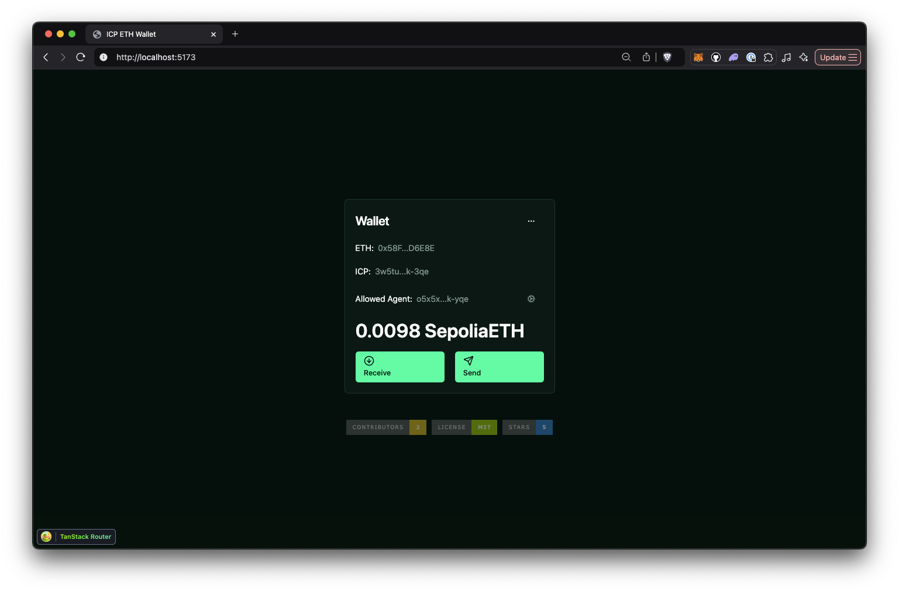

# A multiuser Ethereum wallet built on ICP

This multiuser Ethereum wallet uses allows the user to generate an Ethereum
address by logging in with their Internet Identity. The user can then send and
receive Ethereum to other users.

The backend consists of a Rust canister uses the
[ic-alloy](https://github.com/ic-alloy) library to interact with the Ethereum
blockchain. The frontend is built with React and Vite.

[![Contributors][contributors-shield]][contributors-url]
[![Forks][forks-shield]][forks-url]
[![Stargazers][stars-shield]][stars-url]
[![Issues][issues-shield]][issues-url]
[![MIT License][license-shield]](LICENSE)


> [!TIP]
> Use this repository as a starting point for building your own multiuser Ethereum wallet on the Internet Computer.
> 
> Live demo: <https://7vics-6yaaa-aaaai-ap7lq-cai.icp0.io>



## Project notes

At all times when interacting with canisters on the IC you should consider the
costs involved, and the fact that update calls take 2-3 seconds to complete. To
create a good user experience, this wallet uses a combination of local state and
canister calls to provide a responsive UI.

- The Ethereum address is stored in local state after the user logs in. Next
  time the user logs in, the address is retrieved from local state.
- The balance of the Ethereum address is not queried from the backend canister.
  Instead, the frontend queries the balance from an Ethereum RPC endpoint. This
  is more efficient than making a canister call.

## Prerequisites

### `dfx`

The project requires the IC developer environment to be installed.

- [Installation instructions](https://internetcomputer.org/docs/current/developer-docs/backend/rust/dev-env)

### `pnpm`

Use `pnpm` to install the frontend dependencies.

- [Installation instructions](https://pnpm.io/installation)

### Etherscan API key

An Etherscan API is required to query the wallet ETH balance.

- [Get an API key](https://etherscan.io/apis)

Save the API key to a file named `.env.local` in the root of the project:

```bash
echo "VITE_ETHERSCAN_API_KEY=YOUR_API_KEY" > .env.local
```

## Build and deploy

### 1. Start the local IC replica

```bash
dfx start --background --clean
```

### 2. Install frontend dependencies

```bash
pnpm install
```

### 3. Deploy

```bash
dfx deploy
```

## Develop

During development, you can run the frontend with hot reloading using Vite.

```bash
pnpm run dev
```

## Backend canister methods

### `get_address`

Get the Ethereum address for the calling principal or for the principal
specified in the call parameters.

Call signature:

```
get_address: (owner: opt principal) → (variant {Ok:text; Err:text})
```

Get the Ethereum address for the calling principal:

```bash
dfx canister call backend get_address
```

Get the Ethereum address for a specified principal:

```bash
dfx canister call backend get_address '(opt principal "hkroy-sm7vs-yyjs7-ekppe-qqnwx-hm4zf-n7ybs-titsi-k6e3k-ucuiu-uqe")'
```

### `get_balance`

Returns the ETH balance of the Ethereum address controlled by a principal.

> [!NOTE]
>
> Making update calls to the backend canister comes with a small cost in cycles.
> And it takes a bit of time. Once the frontend has knowledge about the Ethereum
> address, it is more efficient to query the balance directly from an Ethereum
> RPC endpoint outside of the IC.

Call signature:

```
get_balance: (owner: opt principal) → (variant {Ok:text; Err:text})
```

Get the ETH balance for the calling principal:

```bash
dfx canister call backend get_balance
```

Get the ETH balance for a specified principal:

```bash
dfx canister call backend get_balance '(opt principal "hkroy-sm7vs-yyjs7-ekppe-qqnwx-hm4zf-n7ybs-titsi-k6e3k-ucuiu-uqe")'
```

### `send_eth`

Sends ETH from the Ethereum controlled by the calling principal to any
recipient.

Call signature:

```
send_eth : (to: text, amount: Wei) -> (variant {Ok:text; Err:text});
```

Send ETH by specifying receiver address and ETH amount (in wei):

```bash
dfx canister call backend send_eth '("0xa32aECda752cF4EF89956e83d60C04835d4FA867", 1)'
```

## Contributors

<!-- readme: collaborators,contributors -start -->
<table>
	<tbody>
		<tr>
            <td align="center">
                <a href="https://github.com/kristoferlund">
                    
                    <br />
                    <sub><b>Kristofer</b></sub>
                </a>
            </td>
		</tr>
	<tbody>
</table>
<!-- readme: collaborators,contributors -end -->

## License

This project is licensed under the MIT License. See the LICENSE file for more
details.

## Contributing

Contributions are welcome! Please open an issue or submit a pull request if you
have any suggestions or improvements.

[contributors-shield]: https://img.shields.io/github/contributors/ic-alloy/ic-alloy-basic-wallet.svg?style=for-the-badge
[contributors-url]: https://github.com/ic-alloy/ic-alloy-basic-wallet/graphs/contributors
[forks-shield]: https://img.shields.io/github/forks/ic-alloy/ic-alloy-basic-wallet.svg?style=for-the-badge
[forks-url]: https://github.com/ic-alloy/ic-alloy-basic-wallet/network/members
[stars-shield]: https://img.shields.io/github/stars/ic-alloy/ic-alloy-basic-wallet?style=for-the-badge
[stars-url]: https://github.com/ic-alloy/ic-alloy-basic-wallet/stargazers
[issues-shield]: https://img.shields.io/github/issues/ic-alloy/ic-alloy-basic-wallet.svg?style=for-the-badge
[issues-url]: https://github.com/ic-alloy/ic-alloy-basic-wallet/issues
[license-shield]: https://img.shields.io/github/license/ic-alloy/ic-alloy-basic-wallet.svg?style=for-the-badge
[license-url]: https://github.com/ic-alloy/ic-alloy-basic-wallet/blob/master/LICENSE.txt